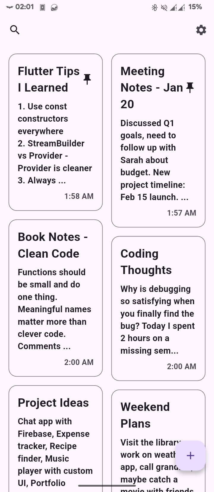
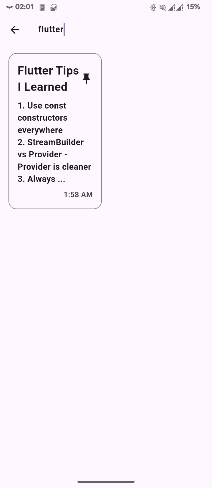
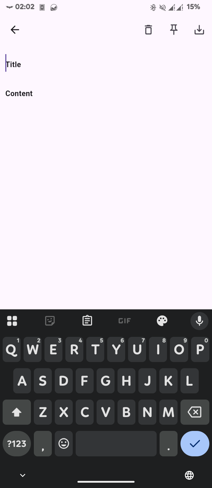
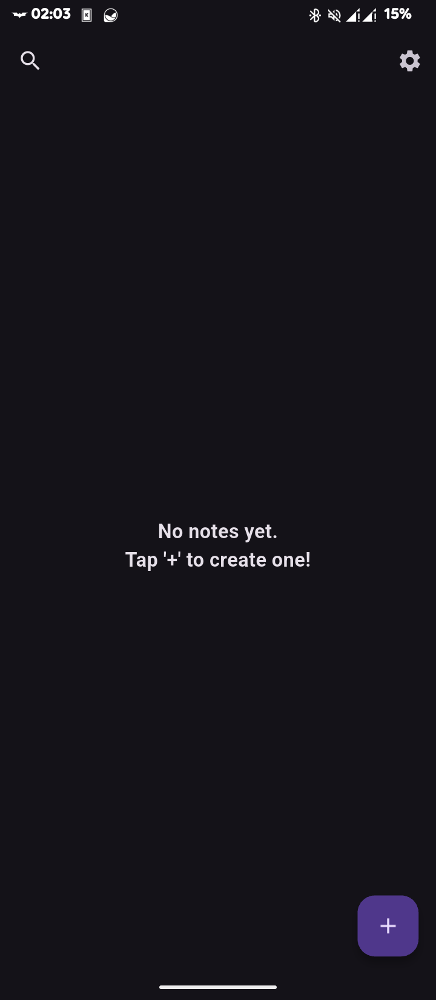
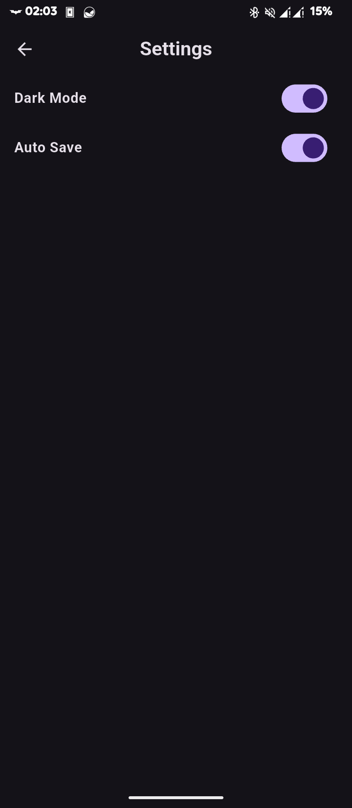
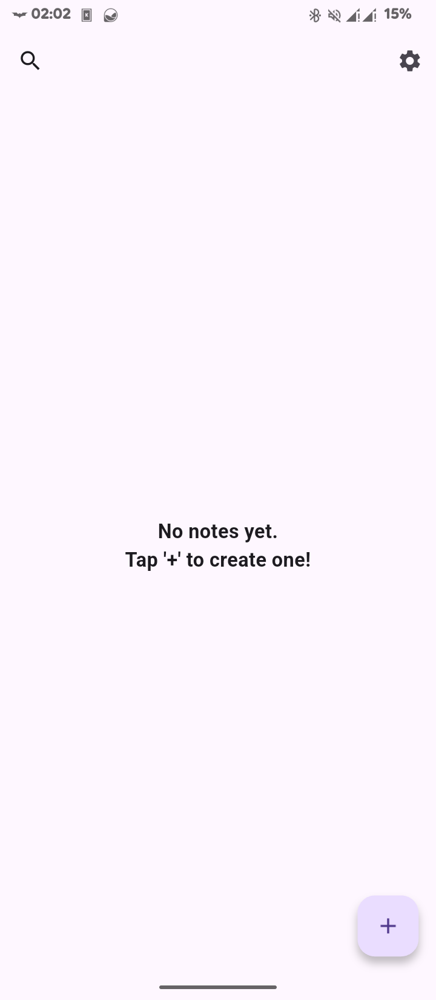

# Simple Notes


A clean, minimalist note-taking app built with Flutter. Perfect for quick thoughts, ideas, and reminders.

## Features

- **Create & Edit Notes**: Simple and intuitive note creation
- **Search**: Find your notes quickly with search functionality
- **Pin Notes**: Keep important notes at the top
- **Dark/Light Theme**: Choose your preferred theme
- **Auto-Save**: Your notes are automatically saved as you type
- **Responsive Design**: Works great on all screen sizes
- **Material Design 3**: Modern, clean UI following Material Design principles

## Screenshots

<p align="center">
  
  
  
</p>

<p align="center">
  
  
  
</p>

## Tech Stack

- **Framework**: Flutter 3.35.1
- **State Management**: Riverpod
- **Database**: Drift (SQLite)
- **UI**: Material Design 3
- **Architecture**: Clean Architecture with Provider pattern

## Getting Started

### Prerequisites
- Flutter SDK (3.35.1 or higher)
- Dart SDK
- Android Studio / VS Code

### Installation

1. **Clone the repository**
   ```bash
   git clone https://github.com/oreiscool/simple_notes.git
   cd simple_notes
   ```

2. **Install dependencies**
   ```bash
   flutter pub get
   ```

3. **Run the app**
   ```bash
   flutter run
   ```

## Building for Release

### Android APK
```bash
flutter build apk --release
```

### Android App Bundle (for Play Store)
```bash
flutter build appbundle --release
```

## Project Structure

```
lib/
├── data/           # Database and data layer
├── models/         # Data models
├── pages/          # UI screens
├── provider/       # State management
└── widgets/        # Reusable UI components
```

## Contributing

1. Fork the project
2. Create your feature branch (`git checkout -b feature/AmazingFeature`)
3. Commit your changes (`git commit -m 'Add some AmazingFeature'`)
4. Push to the branch (`git push origin feature/AmazingFeature`)
5. Open a Pull Request

## License

This project is licensed under the MIT License - see the [LICENSE](LICENSE) file for details.

## Acknowledgments

- Built with Flutter
- Icons from Material Design
- Inspired by clean, minimalist design principles

---

**Made by Stevie**
